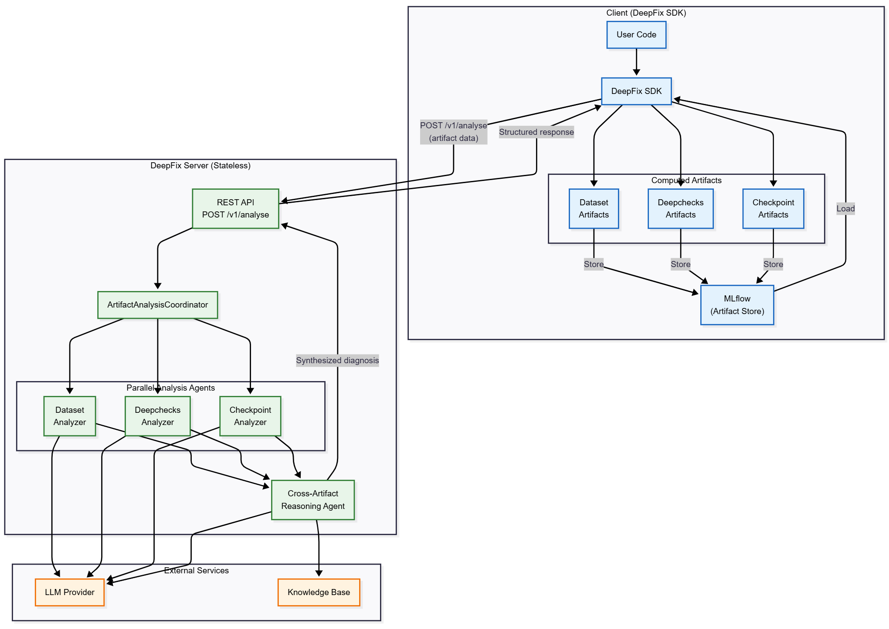
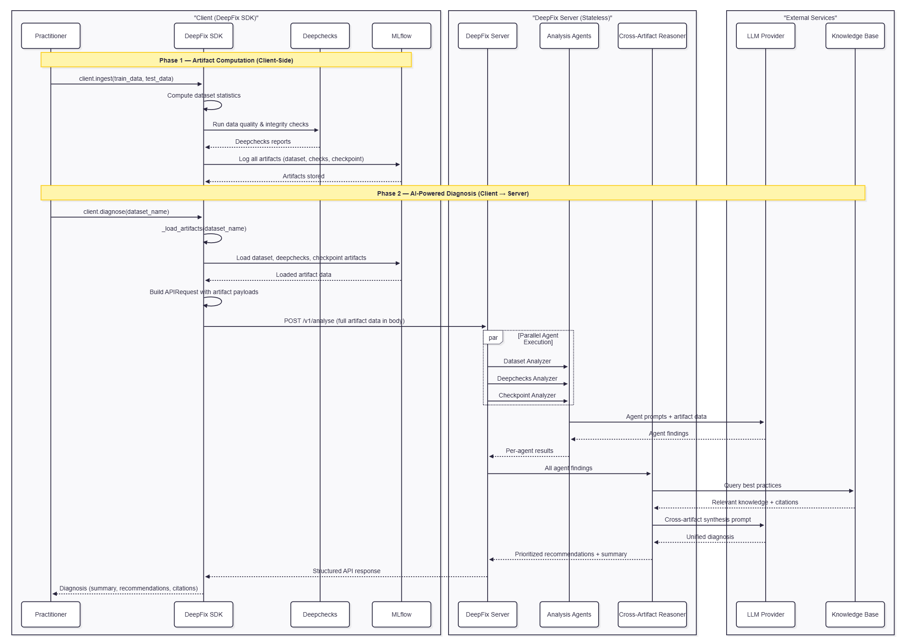

This page details the client–server architecture of DeepFix: what each side is responsible for, how they communicate, and the main design constraints.

## Overview

DeepFix separates artifact computation (client) from AI-powered analysis (server). This enables scalability, flexibility, and maintainability.



## Architecture Decision

**Server state management: hybrid (stateless + in-memory cache).**

- Stateless core API for horizontal scalability.
- In-memory LRU cache for knowledge retrieval (upgradeable to Redis).
- MLflow as the persistent artifact store.
- Local-first deployment model.

### Key Design Choices

| Aspect            | Decision                      | Rationale                                          |
|-------------------|-------------------------------|----------------------------------------------------|
| Communication     | REST API                      | Simple, HTTP-based, widely supported               |
| Artifact Storage  | Server pulls from MLflow      | Simplifies client, centralizes access control      |
| State Management  | Stateless + cache             | Enables scaling, simpler deployment                |
| Deployment        | Local-first                   | Matches expected usage, easier to run and debug    |

## Server Responsibilities

The DeepFix server is responsible for:

### 1. AI-Powered Analysis

- Execute the multi-agent analysis pipeline.
- Coordinate agent execution (parallel where possible).
- Aggregate agent results into unified output.
- Generate natural-language summaries and recommendations.

The server does **not**:

- Train models.
- Compute metrics or run training loops.

### 2. Knowledge Retrieval

- Query the knowledge base via a `KnowledgeBridge`.
- Cache knowledge retrieval results.
- Validate retrieved knowledge against the agent context.
- Attach knowledge citations to responses.

The server does **not** own:

- Knowledge base updates or curation.

### 3. Result Formatting

- Transform agent results into the API response schema.
- Prioritize findings by severity and confidence.
- Format recommendations as concrete steps.

### 4. Error Handling

- Validate incoming requests against the schema.
- Handle MLflow connection failures.
- Manage agent timeouts and execution errors.
- Return structured error messages.

## Server Boundaries

**What the server does:**

- ✅ Run AI analysis on artifacts.
- ✅ Query and cache knowledge.
- ✅ Return structured results.

**What the server does not do:**

- ❌ Compute or generate artifacts.
- ❌ Store artifacts permanently.
- ❌ Log to MLflow.
- ❌ Train models.
- ❌ Manage user sessions.

## Client Responsibilities

The DeepFix SDK (client) is responsible for:

### 1. Artifact Computation

- Generate datasets, Deepchecks reports, model checkpoints.
- Compute training metrics and logs.
- Run data quality checks and extract statistics.

### 2. Artifact Recording

- Store artifacts in an MLflow tracking server or local store.
- Tag artifacts with metadata (dataset name, run ID, etc.).
- Handle artifact upload errors and retries.

### 3. Workflow Integration

- Integrate with PyTorch Lightning (callbacks/hooks).
- Integrate with MLflow experiments.
- Support notebooks, scripts, and pipelines.

### 4. Client Communication

- Send analysis requests to the DeepFix server.
- Handle server responses and errors.
- Implement retry logic for transient failures.
- Provide clear error messages to users.

### 5. Result Processing

- Parse server responses.
- Display results in notebooks, logs, or UIs.
- Optionally store results back into MLflow.

## Client Boundaries

**What the client does:**

- ✅ Compute artifacts (datasets, checks, metrics).
- ✅ Store artifacts in MLflow.
- ✅ Send analysis requests.
- ✅ Render results to users.

**What the client does not do:**

- ❌ Run AI analysis.
- ❌ Query the knowledge base directly.
- ❌ Manage server state.

## Communication Protocol

### REST API

The client and server communicate via a JSON-over-HTTP API.

- **Endpoint**: `POST /v1/analyse`
- **Protocol**: HTTP/HTTPS
- **Format**: JSON

**Request format:**

```json
{
  "dataset_name": "my-dataset",
  "dataset_artifacts": {},
  "deepchecks_artifacts": {},
  "model_checkpoint_artifacts": {},
  "training_artifacts": {},
  "language": "english"
}
```

**Response format:**

```json
{
  "agent_results": {},
  "summary": "Cross-artifact summary...",
  "additional_outputs": {
    "recommendations": [],
    "citations": []
  },
  "error_messages": {}
}
```

### Error Handling

Typical server errors:

- `400 Bad Request`: invalid request.
- `404 Not Found`: artifacts not found.
- `500 Internal Server Error`: server error.
- `503 Service Unavailable`: overloaded or offline.

Typical client-side handling:

- Retry with backoff on transient errors.
- Surface validation errors clearly.
- Log and expose server-side error messages.

## Workflow Patterns

The sequence diagram below illustrates the end-to-end DeepFix workflow, divided into two main phases:

1. **Phase 1: Artifact Computation (Client-Side)**
   The DeepFix SDK operates entirely on the client. It computes dataset statistics, runs data quality checks via Deepchecks, and securely logs the resulting artifacts to MLflow.

2. **Phase 2: AI-Powered Diagnosis (Client to Server)**
   When a diagnosis is requested, the SDK retrieves the stored artifacts and sends them as an API payload to the DeepFix server. The server orchestrates multiple analysis agents in parallel, queries an external LLM provider, and uses a Cross-Artifact Reasoner alongside a Knowledge Base. The final result is a synthesized, unified diagnosis containing prioritized recommendations returned to the user.




### Synchronous Analysis

```text
Client → Ingest Artifacts → Request Analysis → Wait for Results → Display
```

## Design Rationale

### Why Client–Server?

1. Separation of concerns between computation and analysis.
2. Independent scaling of the analysis service.
3. Easier updates to analysis logic without touching training code.

### Why Stateless Server?

1. Easier horizontal scaling and load balancing.
2. No session state to manage or migrate.
3. More robust restarts and deployments.

### Why MLflow for Artifacts?

1. Integrates with existing ML workflows.
2. Standard artifact tracking and versioning.
3. Rich ecosystem and UI.

## Related Documentation

- [Architecture Overview](/architecture/overview)
- [Agent System](/architecture/agents)
- [API Reference](/api-reference/introduction)
